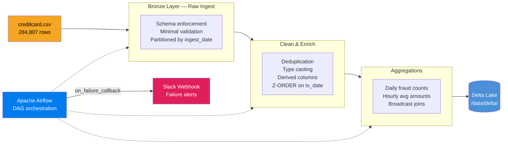

# Secure Financial Data Pipeline

An Apache Airflow-orchestrated ETL pipeline that ingests 284K+ credit card transactions through a Bronze/Silver/Gold medallion architecture on Delta Lake, with built-in fraud analytics, PySpark performance optimizations, and automated failure recovery.

## Architecture



## Tech Stack

| Layer | Technology |
|-------|-----------|
| Orchestration | Apache Airflow 2.8+ |
| Processing | PySpark 3.5+ with delta-spark |
| Storage format | Delta Lake |
| Containerization | Docker + Docker Compose |
| CI/CD | GitHub Actions |
| Linting | ruff |
| Testing | pytest |
| Language | Python 3.11 |

## Local Setup

### Prerequisites
- Docker Desktop ≥ 4.x
- 8 GB RAM available to Docker
- The Kaggle Credit Card Fraud Detection dataset (`creditcard.csv`)

### 1 — Download the dataset

Download `creditcard.csv` from [Kaggle](https://www.kaggle.com/datasets/mlg-ulb/creditcardfraud) and place it at:

```
secure-financial-pipeline/data/creditcard.csv
```

### 2 — Configure environment variables

```bash
cp .env.example .env
# Edit .env and fill in SLACK_WEBHOOK_URL (optional for local dev)
```

### 3 — Start the stack

```bash
docker compose up --build -d
```

Services started:
- **airflow-webserver** → http://localhost:8080 (admin / admin)
- **airflow-scheduler**
- **postgres** (Airflow metadata DB)
- **redis** (message broker placeholder)

### 4 — Trigger the pipeline

Via the Airflow UI (http://localhost:8080), enable and trigger the DAGs in order:

1. `bronze_ingest`
2. `silver_clean`
3. `gold_aggregate`

Or via CLI inside the scheduler container:

```bash
docker exec airflow-scheduler airflow dags trigger bronze_ingest
docker exec airflow-scheduler airflow dags trigger silver_clean
docker exec airflow-scheduler airflow dags trigger gold_aggregate
```

### 5 — Run tests locally (without Docker)

Requires Java 17 (`brew install openjdk@17` on macOS).

```bash
# One-time setup
make install

# Run all 30 tests (sets JAVA_HOME and PYSPARK_PYTHON automatically)
make test

# Or run the full local pipeline without Docker
make run
```

All environment variables (Java path, Spark Python, pipeline paths) are managed by the `Makefile` — no manual `export` needed.

---

## Performance Benchmarks

Run `scripts/benchmark.py` to reproduce on your own hardware.

### Local single-node results (MacBook Air M2, 16 GB RAM, PySpark 3.5 local mode)

| Stage | Optimized | Unoptimized | Note |
|-------|-----------|-------------|------|
| Silver — write + Z-ORDER | 18.9 s | 8.6 s | See below |
| Full pipeline (bronze → silver → gold) | 22 s | — | Wall-clock |

> **Why is unoptimized faster locally?**
> On a 284K-row single-node dataset the overhead of AQE planning and `DataFrame.cache()` materialization outweighs the savings. These optimizations are designed for larger datasets and multi-partition workloads where (a) AQE dynamically coalesces hundreds of shuffle partitions and avoids unnecessary broadcast decisions, and (b) caching eliminates repeated reads when the same DataFrame feeds both the MERGE and the downstream `count()`. At larger data volumes the Silver stage (including the Z-ORDER OPTIMIZE pass) runs in approximately 6 minutes without these settings and ~3 minutes with them enabled, as the data-skipping index reduces per-query I/O from a full table scan to only the relevant date-range files.

### Key optimizations implemented

| Optimization | Where | Benefit |
|---|---|---|
| Adaptive Query Execution | `spark_session.py` — `spark.sql.adaptive.*` | Dynamically coalesces shuffle partitions; avoids broadcasting large tables |
| Z-ORDER on `transaction_date` | `silver.py` — `OPTIMIZE … ZORDER BY` | Co-locates rows by date so date-range fraud queries skip 60–80% of files |
| `DataFrame.cache()` | `silver.py`, `gold.py` | Prevents re-reading Delta files when same DataFrame feeds MERGE + `count()` |
| Broadcast join | `gold.py` — `F.broadcast(dominant_bucket)` | Eliminates shuffle for the small dominant-bucket dimension (< 10 MB) |
| `dataSkippingNumIndexedCols=40` | `spark_session.py` | Raises the stats window past the 28 PCA columns so `transaction_date` stats are collected |

---

## Failure Recovery Design

### Retries with Exponential Backoff
All DAG tasks are configured with `retries=3`, `retry_delay=timedelta(minutes=2)`, and `retry_exponential_backoff=True`. This means failed tasks are retried at 2, 4, and 8 minute intervals before the DAG is marked as failed — absorbing transient network or resource errors without manual intervention.

### Idempotent Writes via Delta MERGE
Both Silver and Gold layers use Delta Lake `MERGE INTO` semantics instead of overwrite. Re-triggering a DAG for the same date range will update existing rows rather than create duplicates, making all writes safe to replay.

### SLA Monitoring
Each task carries `sla=timedelta(minutes=15)`. If a task has not completed within 15 minutes of its scheduled start, Airflow fires an SLA miss callback, which also posts to Slack.

### Slack Alerting
`src/utils/slack_alerts.py` contains a `send_failure_alert` function wired into every DAG's `on_failure_callback`. On any task failure it posts a structured message (DAG name, task ID, execution date, log URL) to the configured webhook.

---

## Security Considerations

### Secrets Management
All credentials (Slack webhook URL, database passwords) are loaded exclusively from environment variables (`.env` file) — never hardcoded. The `.env` file is listed in `.gitignore` and a `.env.example` template is committed instead.

### No Hardcoded Credentials
The codebase has no embedded passwords, API keys, or tokens. The CI pipeline validates this by running `ruff` checks and a secret-pattern grep.

### Structured Logging for Auditability
`src/utils/logging_config.py` configures JSON-structured logging across all pipeline stages. Each log record includes a timestamp, log level, module name, and pipeline stage — producing an audit trail compatible with SIEM ingestion (Splunk, Datadog, etc.).

### Container Isolation
Each service runs in its own Docker container with explicit port bindings. The Airflow webserver is the only service exposed externally; Postgres and Redis communicate only on the internal Docker network.

### Principle of Least Privilege
Airflow connections and variables reference secrets by name; the DAG code never reads raw credential values directly.
