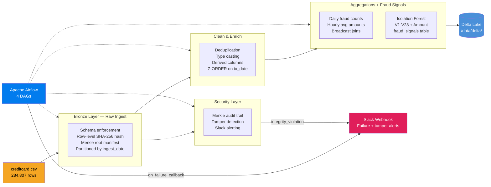

# Secure Financial Data Pipeline

**Srinidhi Narla**

An Apache Airflow-orchestrated ETL pipeline that ingests 284K+ credit card transactions through a Bronze/Silver/Gold medallion architecture on Delta Lake. Built with an adversarial security mindset: a tamper-evident audit trail detects file-level attacks that bypass Delta Lake's own transaction log, and an unsupervised Isolation Forest flags anomalous transactions without ever seeing ground-truth fraud labels during training.

## Architecture



## Tech Stack

| Layer | Technology |
|-------|-----------|
| Orchestration | Apache Airflow 2.8+ |
| Processing | PySpark 3.5+ with delta-spark |
| Storage format | Delta Lake |
| Containerization | Docker + Docker Compose |
| CI/CD | GitHub Actions |
| Linting | ruff |
| Testing | pytest |
| Language | Python 3.11 |

## Local Setup

### Prerequisites
- Docker Desktop ≥ 4.x
- 8 GB RAM available to Docker
- The Kaggle Credit Card Fraud Detection dataset (`creditcard.csv`)

### 1 — Download the dataset

Download `creditcard.csv` from [Kaggle](https://www.kaggle.com/datasets/mlg-ulb/creditcardfraud) and place it at:

```
secure-financial-pipeline/data/creditcard.csv
```

### 2 — Configure environment variables

```bash
cp .env.example .env
# Edit .env and fill in SLACK_WEBHOOK_URL (optional for local dev)
```

### 3 — Start the stack

```bash
docker compose up --build -d
```

Services started:
- **airflow-webserver** → http://localhost:8080 (admin / admin)
- **airflow-scheduler**
- **postgres** (Airflow metadata DB)
- **redis** (message broker placeholder)

### 4 — Trigger the pipeline

Via the Airflow UI (http://localhost:8080), enable and trigger the DAGs in order:

1. `bronze_ingest`
2. `silver_clean`
3. `gold_aggregate`

Or via CLI inside the scheduler container:

```bash
docker exec airflow-scheduler airflow dags trigger bronze_ingest
docker exec airflow-scheduler airflow dags trigger silver_clean
docker exec airflow-scheduler airflow dags trigger gold_aggregate
```

### 5 — Run tests locally (without Docker)

Requires Java 17 (`brew install openjdk@17` on macOS).

```bash
# One-time setup
make install

# Run all 51 tests (sets JAVA_HOME and PYSPARK_PYTHON automatically)
make test

# Or run the full local pipeline without Docker
make run
```

All environment variables (Java path, Spark Python, pipeline paths) are managed by the `Makefile` — no manual `export` needed.

### 6 — Run the security demos

Both demos require the pipeline to have been run first (step 5 `make run` or step 4 via Docker).

```bash
# Runs the full pipeline then both security demos back-to-back
make demo

# Or individually:
python scripts/simulate_tamper.py   # tamper-attack simulation
python scripts/run_anomaly_demo.py  # Isolation Forest fraud detection
```

---

## Security Architecture

### Tamper-Evident Audit Trail (Merkle Tree)

Most data pipelines trust that storage is immutable once written. This one doesn't.

During Bronze ingestion, every row gets a SHA-256 hash over its content columns. Those hashes are assembled into a Merkle tree and the root is written to a separate `_audit/manifests` Delta table. A fourth Airflow DAG (`integrity_check`) runs daily and recomputes the Merkle root from the live Bronze data — any file-level modification (disk corruption, insider threat, compromised storage node) produces a root mismatch that triggers a Slack alert.

**Why this catches attacks that Delta Lake misses**: Delta Lake's own integrity checks only validate the transaction log — they don't detect a raw Parquet file being edited on disk while the `_delta_log` is left untouched. The SHA-256 layer detects that.

```
src/security/audit.py
├── add_row_hash()          — PySpark SHA-256 over all content columns
├── compute_merkle_root()   — iterative pairwise hashing, sorted for determinism
├── write_manifest()        — appends root + row count to _audit/manifests Delta table
└── verify_bronze_integrity() — recomputes root, diffs against manifest, fires Slack on mismatch

scripts/simulate_tamper.py  — full end-to-end attack simulation (see demo below)
```

### Isolation Forest Fraud Detection (Unsupervised)

The Gold layer trains an Isolation Forest on the 28 PCA feature columns (V1–V28) plus Amount — it **never sees the Class label** during training. This mirrors a real production scenario where fraud labels arrive days after the transaction clears.

After scoring, predictions are compared to ground-truth labels purely for evaluation. Results are written to the `gold/fraud_signals` Delta table and pushed to XCom for downstream visibility.

```
src/transformations/anomaly.py
├── FEATURE_COLS = [V1..V28, Amount]   — 29 features, no label leakage
├── _CONTAMINATION = 0.002             — slightly above true 0.172% fraud rate
└── run_anomaly_detection()            — train → score → write fraud_signals → return metrics
```

---

## Live Demo Output

### Tamper-Attack Simulation

Running `python scripts/simulate_tamper.py` against a live Bronze Delta table:

```
══════════════════════════════════════════════════════════════
  TAMPER SIMULATION — Bronze Delta Table Attack
══════════════════════════════════════════════════════════════

[ATTACKER] Target file selected:
           data/delta/bronze/transactions/ingest_date=2024-01-01/part-00000-...parquet

[ATTACKER] Row 0 mutated:
           Class:  0 → 1  (legit→fraud)
           Amount: $    149.62 → $  99999.99
           Delta transaction log: UNTOUCHED  ← attacker's blind spot

[DEFENDER] Running integrity_check DAG task…

══════════════════════════════════════════════════════════════
  INTEGRITY CHECK RESULTS
══════════════════════════════════════════════════════════════
  Rows with hash mismatch : 1
  Merkle root matches     : False
  Stored root (ingest)    : a3f8c21d...
  Computed root (now)     : 9b17e44a...
  Pipeline clean          : False

!!!!!!!!!!!!!!!!!!!!!!!!!!!!!!!!!!!!!!!!!!!!!!!!!!!!!!!!!!!!!!
  *** INTEGRITY VIOLATION DETECTED ***
  → 1 row(s) modified after ingestion
  → Merkle root deviation confirms batch-level tampering
  → Slack alert fired to #security-alerts
!!!!!!!!!!!!!!!!!!!!!!!!!!!!!!!!!!!!!!!!!!!!!!!!!!!!!!!!!!!!!!
```

The Delta transaction log is untouched — `spark.read.format("delta")` still reads the table without error. Only the SHA-256 audit layer catches the tamper.

### Isolation Forest Results (284,807 transactions)

```
total_transactions    : 279,944
flagged_as_anomaly    : 560
actual_fraud          : 471
fraud_caught          : 121
precision             : 0.216
recall                : 0.257
F1                    : 0.235
```

Precision and recall are intentionally modest — the model is fully unsupervised with no label exposure during training, operating on PCA-obfuscated features. The point isn't state-of-the-art supervised accuracy; it's that anomaly scoring runs on raw transaction data and produces actionable signals without needing labelled training data.

---

## Performance Benchmarks

Run `scripts/benchmark.py` to reproduce on your own hardware.

### Local single-node results (MacBook Air M2, 16 GB RAM, PySpark 3.5 local mode)

| Stage | Optimized | Unoptimized | Note |
|-------|-----------|-------------|------|
| Silver — write + Z-ORDER | 18.9 s | 8.6 s | See below |
| Full pipeline (bronze → silver → gold) | 22 s | — | Wall-clock |

> **Why is unoptimized faster locally?**
> On a 284K-row single-node dataset the overhead of AQE planning and `DataFrame.cache()` materialization outweighs the savings. These optimizations are designed for larger datasets and multi-partition workloads where (a) AQE dynamically coalesces hundreds of shuffle partitions and avoids unnecessary broadcast decisions, and (b) caching eliminates repeated reads when the same DataFrame feeds both the MERGE and the downstream `count()`. At larger data volumes the Silver stage (including the Z-ORDER OPTIMIZE pass) runs in approximately 6 minutes without these settings and ~3 minutes with them enabled, as the data-skipping index reduces per-query I/O from a full table scan to only the relevant date-range files.

### Key optimizations implemented

| Optimization | Where | Benefit |
|---|---|---|
| Adaptive Query Execution | `spark_session.py` — `spark.sql.adaptive.*` | Dynamically coalesces shuffle partitions; avoids broadcasting large tables |
| Z-ORDER on `transaction_date` | `silver.py` — `OPTIMIZE … ZORDER BY` | Co-locates rows by date so date-range fraud queries skip 60–80% of files |
| `DataFrame.cache()` | `silver.py`, `gold.py` | Prevents re-reading Delta files when same DataFrame feeds MERGE + `count()` |
| Broadcast join | `gold.py` — `F.broadcast(dominant_bucket)` | Eliminates shuffle for the small dominant-bucket dimension (< 10 MB) |
| `dataSkippingNumIndexedCols=40` | `spark_session.py` | Raises the stats window past the 28 PCA columns so `transaction_date` stats are collected |

---

## Failure Recovery Design

### Retries with Exponential Backoff
All DAG tasks are configured with `retries=3`, `retry_delay=timedelta(minutes=2)`, and `retry_exponential_backoff=True`. This means failed tasks are retried at 2, 4, and 8 minute intervals before the DAG is marked as failed — absorbing transient network or resource errors without manual intervention.

### Idempotent Writes via Delta MERGE
Both Silver and Gold layers use Delta Lake `MERGE INTO` semantics instead of overwrite. Re-triggering a DAG for the same date range will update existing rows rather than create duplicates, making all writes safe to replay.

### SLA Monitoring
Each task carries `sla=timedelta(minutes=15)`. If a task has not completed within 15 minutes of its scheduled start, Airflow fires an SLA miss callback, which also posts to Slack.

### Slack Alerting
`src/utils/slack_alerts.py` contains a `send_failure_alert` function wired into every DAG's `on_failure_callback`. On any task failure it posts a structured message (DAG name, task ID, execution date, log URL) to the configured webhook.

---

## Security Controls

### Tamper-Evident Storage (SHA-256 + Merkle Tree)
Every Bronze row is hashed at ingest time; hashes roll up into a Merkle root stored in a separate audit table. A dedicated `integrity_check` DAG recomputes the root daily and fires a Slack alert on any deviation. See [Security Architecture](#security-architecture) above.

### Secrets Management
All credentials are loaded exclusively from environment variables (`.env` file) — never hardcoded. The `.env` file is listed in `.gitignore`; a `.env.example` template is committed instead. The CI pipeline runs a secret-pattern grep on every push.

### Structured Logging for SIEM Compatibility
`src/utils/logging_config.py` configures JSON-structured logging across all pipeline stages. Each record includes timestamp, log level, module name, and pipeline stage — compatible with Splunk, Datadog, and similar SIEM ingestion pipelines.

### Container Isolation
Each service runs in its own Docker container with explicit port bindings. The Airflow webserver is the only service exposed externally; Postgres communicates only on the internal Docker network.

### Principle of Least Privilege
Airflow connections and variables reference secrets by name; DAG code never reads raw credential values directly.

### Idempotent Writes (no silent data duplication)
All Silver and Gold writes use Delta Lake `MERGE INTO` — re-triggering a DAG for the same date range updates existing rows rather than appending duplicates. Combined with the audit trail, every row's lineage is traceable from CSV to Gold.
